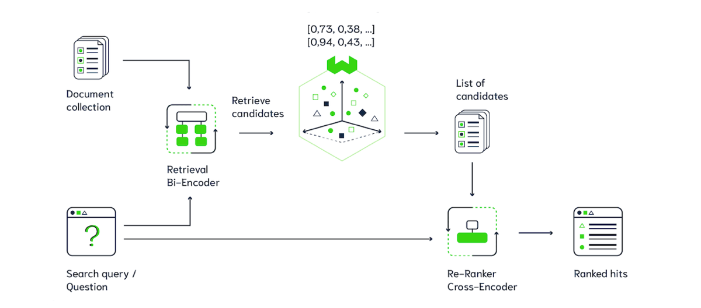

# Vietnamese Legal Document Retrieval – SoICT Hackathon 2024

## Overview

This repository contains the implementation of a **Vietnamese Legal Document Retrieval System** developed for the **SoICT Hackathon 2024** in Ho Chi Minh City.
The system was trained on approximately **119,000 query–document pairs** and evaluated using **MRR@10** on both public and private test sets.

It combines a **bi-encoder** for initial retrieval and a **cross-encoder** for reranking, optimized specifically for Vietnamese legal language.

---

## System Architecture

The retrieval pipeline consists of two main components: a **Bi-Encoder retriever** and a **Cross-Encoder reranker**.

**Pipeline flow:**

```
User Query → Word Segmentation (Pyvi) → Bi-Encoder (Retrieval)
            → Top-K Documents → Cross-Encoder (Reranking)
            → Final Ranked Results
```

**Architecture Diagram:**


---

### 1. **Bi-Encoder (Retriever)**

* Based on the **BKAI Sentence Transformer** model.
* Fine-tuned using the official SoICT dataset.
* **Loss function:** `CachedMultipleNegativesRankingLoss`, which improves training efficiency and diversity of negative samples compared to standard `MultipleNegativesRankingLoss`.
* Mini-batch size increased to enhance the model’s generalization.

**Results:**

* `Recall@100 = 0.93`
* `Recall@200 = 0.96`
* `MRR@10 = 0.56`

### 2. **Cross-Encoder (Reranker)**

* Based on **Pho-Rank** and fine-tuned using the outputs of the bi-encoder.
* **Loss function:** Binary Cross Entropy (BCE Loss).
* Input text was preprocessed with **word segmentation using Pyvi**, since Pho-Rank (and most cross-encoders) fail on unsegmented Vietnamese text.
  Example: `"đá_bóng"` instead of `"đá bóng"`.

**Results:**

* After reranking, `MRR@10` improved to **0.70**.

---

## Extended Techniques

### Multi-Query Expansion

* When the cosine similarity between the user query and the retrieved top results falls below **0.7**, the system uses **GPT API** to generate additional semantically related queries.
* This expansion improves recall and robustness against lexical variation.

### Query Decomposition

* For complex or lengthy legal queries, the system splits the question into smaller, manageable sub-queries and merges the results afterward for better retrieval accuracy.

---

## Technologies Used

| Component              | Description                                  |
| ---------------------- | -------------------------------------------- |
| **Word Segmentation**  | Pyvi                                         |
| **Bi-Encoder**         | BKAI Sentence Transformer                    |
| **Cross-Encoder**      | Pho-Rank                                     |
| **Loss Functions**     | CachedMultipleNegativesRankingLoss, BCE Loss |
| **Evaluation Metrics** | Recall@K, MRR@10                             |
| **Language**           | Python                                       |
| **Frameworks**         | PyTorch, SentenceTransformers                |
| **Query Expansion**    | GPT API                                      |

---

## Experimental Results

| Model                       | Recall@100 | Recall@200 | MRR@10   |
| --------------------------- | ---------- | ---------- | -------- |
| Bi-Encoder                  | 0.93       | 0.96       | 0.56     |
| Bi + Cross Encoder (Rerank) | 0.93       | 0.96       | **0.70** |

---

## Dataset

The dataset used in this project was provided by the SoICT Hackathon 2024 organizers.
(**https://www.kaggle.com/datasets/nguyenquangkhai06/soict-hackathon-2024-legal-document-retrieval/data**)

All text data was preprocessed using Pyvi for Vietnamese tokenization prior to training and evaluation.

---

## Setup & Usage

### Installation

```bash
git clone https://github.com/<your-repo>/SoICT-hackathon-2024-document-retrieval.git
cd SoICT-hackathon-2024-document-retrieval
```
---

## Future Work

* Integrate **automatic multi-query expansion** into the production pipeline.
* Incorporate **RAG (Retrieval-Augmented Generation)** for question answering based on legal documents.
* Further fine-tuning hyperparameters for the cross-encoder.
* Optimize retrieval speed with **FAISS GPU indexing**.

---

## Notes

While achieving **MRR@10 = 0.70**, this model is **not yet production-ready** due to performance and stability constraints.
Further work will focus on improving inference efficiency, caching, and distributed retrieval.
